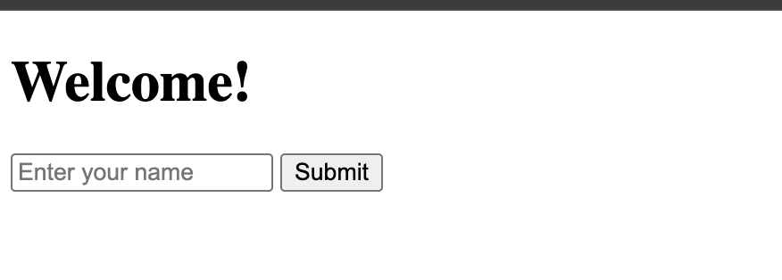

<h1>
  <span class="headline">Selenium: Intro to Browser Automation</span>
  <span class="subhead">Anatomy of a Selenium Script</span>
</h1>

**Learning Objective:** Understand the structure of a simple Selenium script and how to build on it by interacting with page elements.

## The Four-Part Structure of a Selenium Script

Now that you’ve launched your first automated browser session, let’s break it down more deeply. Every Selenium script has four essential stages:

1. **Import tools**
2. **Start the browser**
3. **Do something in the browser**
4. **Clean up and close it down**

We’ll walk through what can go in each part—and then try it out with a local HTML file.

## 1. Importing Selenium tools

At the top of your script, you import what you need.

Basic imports:

```python
from selenium import webdriver
from selenium.webdriver.chrome.service import Service
```

Here are some additional useful imports you'll see in future examples:

```python
from selenium.webdriver.common.by import By
from selenium.webdriver.common.keys import Keys
```

> 💡 As your scripts grow, you’ll import more modules—like tools for waiting, simulating keystrokes, or handling dropdowns.

## 2. Starting the browser

This is where you connect your script to Chrome (or another browser):

```python
chromedriver_path = "/Users/yourname/path/to/chromedriver"
service = Service(executable_path=chromedriver_path)
driver = webdriver.Chrome(service=service)
```

You can also add options (like headless mode or disabling logs) later.

## 3. Sending actions to the browser

This is where things get interesting!

You can:

- Open a page:

  ```python
  driver.get("https://www.python.org")
  ```

- Interact with inputs and buttons:

  ```python
  driver.find_element(By.ID, "username").send_keys("Hello")
  driver.find_element(By.ID, "submit").click()
  ```

- Make assertions:
  ```python
  assert "Python" in driver.title
  ```

We'll try this out in a local practice example below.

## 4. Cleaning up: Always close the browser

```python
driver.quit()
```

For reliability, wrap your script in a try-finally block:

```python
try:
    driver.get("https://www.python.org")
finally:
    driver.quit()
```

> ✅ Always call `driver.quit()` to avoid leaving browser windows running in the background.

<div class="activity guided-walkthrough">
  <h2 class="title">Interact with a Local HTML Page</h2>
  <span class="minutes">15 min</span>
</div>

Let’s apply what you’ve learned by testing a simple HTML form you create yourself.

## Step 1: Create this HTML file

Save the following as `form.html` in your project folder:

```html
<!DOCTYPE html>
<html>
  <head>
    <title>Test Form</title>
  </head>
  <body>
    <h1>Welcome!</h1>
    <input id="username" placeholder="Enter your name" />
    <button id="submit">Submit</button>
  </body>
</html>
```



## Step 2: Write your Python script

Create a file called `test_local_form.py` and add:

```python
from selenium import webdriver
from selenium.webdriver.chrome.service import Service
from selenium.webdriver.common.by import By

chromedriver_path = "/Users/yourname/path/to/chromedriver"  # update as needed
service = Service(executable_path=chromedriver_path)
driver = webdriver.Chrome(service=service)

try:
    driver.get("file:///Users/username/testing-with-selenium/form.html")  # update to your local file path

    # Interact with the page
    driver.find_element(By.ID, "username").send_keys("Your Name")
    driver.find_element(By.ID, "submit").click()

    print("Form interaction completed.")
finally:
    driver.quit()
```

> 💡 `file:///` tells the browser you're opening a file on your computer instead of a live website.

## Optional challenge

Edit your HTML file to include:

- A second input (e.g., `email`)
- A paragraph to display feedback (`<p id="message">...</p>`)

Then update your script to:

- Fill in both inputs
- Assert that the message says what you expect after clicking the button

### Quick Recap: Here's what you just automated:

- Navigating to a **local file**
- Finding elements with **By.ID**
- Typing into an input and clicking a button
- Keeping everything organized using the four-part structure

> 🏆 By understanding the anatomy of a Selenium script and applying it to your own HTML file, you’ve gone from watching a browser open... to making it do exactly what you want.
