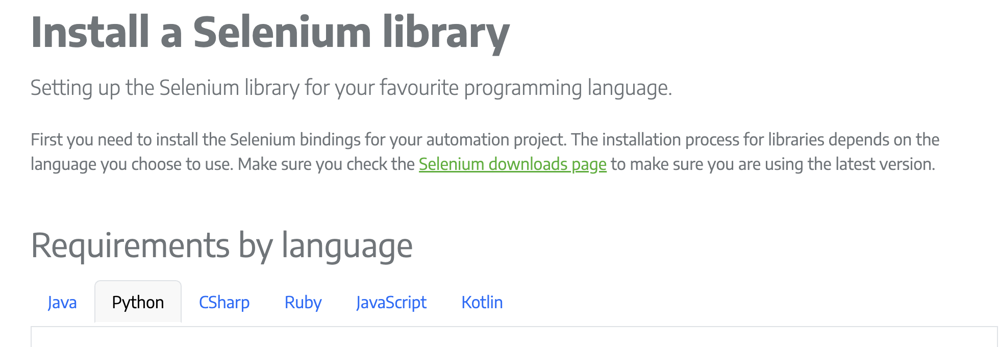
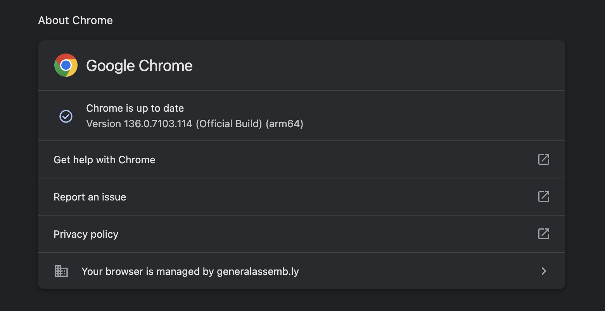
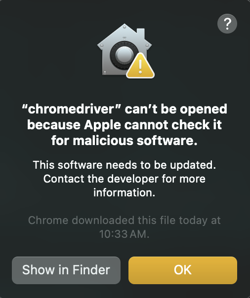

<h1>
  <span class="headline">Selenium: Intro to Browser Automation</span>
  <span class="subhead">Setup</span>
</h1>

**Learning Objective:** Install Selenium and the required web driver for Chrome.

## Creating a new Python virtual environment

Before installing any new libraries or tools, let's set up a fresh Python virtual environment. _Virtual environments_ help keep your project dependencies organized and prevent conflicts between packages in different projects.

> 💡 Think of a virtual environment as a separate workspace for each project. Just as you might use different folders to organize your documents or photos, a virtual environment separates the tools each project needs, protecting you from the problem known as _dependency hell_—where packages required by one project change or interfere with another.

> 📚 A _dependency_ is an external library or package your project needs to function.

If you're working in VS Code and are comfortable in the terminal, follow these steps:

1.  Create a new project folder called `testing-with-selenium`.

2.  Open a new terminal in your project’s folder.

3.  Run this command to create a virtual environment named `venv`:

    ```bash
    python -m venv venv
    ```

4.  Activate your virtual environment:

    - On macOS or Linux:

      ```bash
      source venv/bin/activate
      ```

    - On Windows:

      ```bash
      venv\Scripts\activate
      ```

5.  You will see `(venv)` at the start of your terminal prompt, showing the virtual environment is active.

> 🏆 Using a virtual environment ensures that the packages and tools you install are isolated, so changes for one project do not affect your global Python setup or other projects.

```bash
username ~  $ mkdir testing-with-selenium
username ~  $ cd testing-with-selenium
username ~/testing-with-selenium  $ python -m venv venv
username ~/testing-with-selenium  $ source venv/bin/activate
(venv) username ~/testing-with-selenium  $
```

## Installation

The official Selenium website provides several installation options, but the **easiest way to install Selenium for Python** is by using `pip`, Python’s built-in package manager.

To explore other setup methods or environments, see the [Selenium Installation Docs](https://www.selenium.dev/documentation/webdriver/getting_started/install_library/).



## Installing Selenium using pip

Once your virtual environment is active, you can install Selenium—the main tool for browser automation. _pip_ is the Python package installer you will use.

In your terminal, run:

```bash
pip install selenium
```

This will add Selenium to your project’s environment.

> To confirm that Selenium installed successfully, check its details:

```bash
pip show selenium
```

This prints out information about Selenium, including the version and installation path.

```bash
(venv) username ~/testing-with-selenium  $ pip show selenium
Name: selenium
Version: 4.32.0
Summary: Official Python bindings for Selenium WebDriver
Home-page: https://www.selenium.dev
Author:
Author-email:
License: Apache 2.0
Location: /Users/username/testing-with-selenium/venv/lib/python3.11/site-packages
Requires: certifi, trio, trio-websocket, typing_extensions, urllib3, websocket-client
Required-by:
(venv) username ~/testing-with-selenium  $
```

> 📚 _pip_ stands for “Pip Installs Packages” and is the standard way to add new libraries to Python projects.

## Understanding web drivers and their role

Selenium lets us write code to control a web browser, but how does this communication actually happen? That’s where _web drivers_ come in.

A _web driver_ is a small tool acting as a middle layer between Selenium and your browser of choice (like Chrome, Firefox, or Edge). When your script wants to open a web page or click a button, it sends commands to the web driver. The driver then “translates” these commands and has the browser carry them out.

For this lesson, we’ll use **ChromeDriver** to work with Google Chrome.

> 📚 A _web driver_ is a program that controls a web browser by translating commands from your code into browser actions.

## Downloading and setting up ChromeDriver

To automate Chrome, you need a version of ChromeDriver that matches your Chrome browser version. Follow these steps:

### 1. **Find your Chrome version:**

- Open **Chrome**.
- Click the **menu icon** (three dots).
- Go to **Help** → **About Google Chrome**.
- Copy your full version number (`Version 136.0.7103.114 (Official Build) (arm64)`)



### 2. **Download the right ChromeDriver:**

- Go to the [official download page](https://developer.chrome.com/docs/chromedriver/downloads/version-selection)

- Make sure the Binary you select says `chromedriver`, not just `chrome`.

- Download the correct zip file for your operating system:
  - **Windows** → `chromedriver_win32.zip`
  - **macOS** → `chromedriver_mac64.zip` or `chromedriver_mac_arm64.zip`
  - **Linux** → `chromedriver_linux64.zip`

### 3. **Unzip the file:**

- After downloading the zip file:
  - **On Windows**: Right-click the `.zip` → choose **Extract All** → extract to a folder like `C:\chromedriver`
  - **On macOS/Linux**: Double-click the zip to extract, or use terminal:

```bash
unzip chromedriver_mac64.zip
```

You should now have a file named `chromedriver` (or `chromedriver.exe` on Windows).

### 4. Tell Selenium where to find ChromeDriver

Selenium needs ChromeDriver to control the Chrome browser. After downloading it, you’ll need to unzip the file and add ChromeDriver to your system `PATH` so that Selenium can find it.

## Add ChromeDriver to your PATH

**🖥 For macOS:**

1. Locate your downloaded file:

You’ll see a file like this in your Downloads folder `chromedriver_mac64.zip`

2. Unzip the file:

You can double-click it in Finder or use this command in Terminal.

```bash
unzip ~/Downloads/chromedriver_mac64.zip
```

3. Move the binary to a system directory:

Inside the unzipped `chromedriver_mac64` directory you will find another directory called `chromedriver`. This is your binry file that needs to be moved to your PATH.

```bash
cd chromedriver_mac64
sudo mv chromedriver /usr/local/bin/chromedriver
sudo chmod +x /usr/local/bin/chromedriver
```

4. Verify it’s available:

```bash
chromedriver --version
```

You should see output like:

```bash
ChromeDriver 120.0.6099.109 ...
```

**🖥 For Windows**

1. Find your download:

You should see a file like `chromedriver_win32.zip`

2. Unzip the file:

- Right-click the `.zip` file and choose `Extract All`.

- Open the extracted folder. You should now see a file `chromedriver.exe`

3. Move the file to a permanent location, such as:

```bash
C:\chromedriver
```

5. Add it to your `PATH`:

   - Open Start and search for **Environment Variables**
   - Click **"Edit the system environment variables"**
   - In the System Properties window, click **"Environment Variables..."**
   - Under **System variables**, select **Path** and click **Edit**
   - Click **New** and enter:
     ```bash
     C:\chromedriver
     ```
   - Click **OK** to save and close all dialogs

6. Verify it's working:

- Open Command Prompt

  Run:

  ```bash
  chromedriver --version
  ```

  You should see:

  ```bash
  ChromeDriver 120.0.6099.109 ...
  ```

Once in your PATH, you can launch Selenium without specifying the path:

```python
driver = webdriver.Chrome()
```

### Alternative Option (Not Recommended): Use the full path in your scripts

If you don’t want to update your system PATH or are unable to do so, you can point directly to the ChromeDriver executable in your test files, but will need to remember to include this setup each time:

```python
from selenium import webdriver
from selenium.webdriver.chrome.service import Service

service = Service(executable_path="/your/local/path/to/chromedriver")
driver = webdriver.Chrome(service=service)
```

> Without this code at the top of all your test files selenium will not be able to locate the driver.

## 🛠 Common Issues

- ❌ **Version mismatch**: Always check that Chrome and ChromeDriver versions match
- ❌ **Permission denied** (macOS/Linux): Use `chmod +x chromedriver` to make it executable
- ❌ **PATH not set**: Use Option A and specify the full path instead of relying on PATH

> ✅ Once this is working, you’re ready to launch a browser with Selenium!

## Verifying successful installation

Let's check that everything works together.

1. Open your `testing-with-selenium` project folder in VS Code

2. Create a new Python test file— call it `test_selenium_setup.py`.

Add this code:

```python
from selenium import webdriver
driver = webdriver.Chrome()

driver.get("https://www.python.org")  # Opens the Python website

driver.quit()  # Closes the browser
```

3. Run the script

Save and then run your script in the terminal:

```bash
python test_selenium_setup.py
```

If everything is working, a **Chrome window will open**, load the [https://www.python.org](https://www.python.org) website, and then automatically close.

### 🧪 Success!

If the script runs without errors and the browser briefly opens, your Selenium setup is ready.

> ⚠ If you see an error like **“ChromeDriver not found”**, double-check that the path is correct and that your Chrome version matches your ChromeDriver version.

## Troubleshooting common setup issues

Technical setup can sometimes bring up roadblocks. Here are frequent issues and how to resolve them:

**1. "chromedriver not found" or file not executable**

- Double-check your ChromeDriver path.
- On macOS/Linux, make it executable: `chmod +x chromedriver`.

**2. Version mismatch errors**

- See errors mentioning "version mismatch" or "cannot open browser"? Update Chrome _or_ download the correct ChromeDriver version.

**3. Permission denied**

- You may need to change permissions on macOS/Linux: `chmod +x chromedriver`.

**4. Selenium not installed**

- Was your virtual environment active when you ran `pip install selenium`? Run `pip show selenium` to check.

**5. PATH problems**

- If not updating your PATH, always provide the full path to ChromeDriver as shown in the code example.

**6. Apple Gatekeeper Error**



1. Allow it manually via System Settings:

   - Open System Settings → Privacy & Security
   - Scroll down to Security
   - You should see a message like: "chromedriver" was blocked from use because it is not from an identified developer.
   - Click "Allow Anyway"

   - Then run your script again.
   - macOS will show a second prompt—click "Open"

2. Or allow it via terminal (more direct)

   - If you're comfortable in Terminal, run:

```bash
xattr -d com.apple.quarantine /path/to/chromedriver
```

> If you get stuck, search for your exact error message—many others around the world have solved similar issues. Selenium’s community is a valuable resource.
