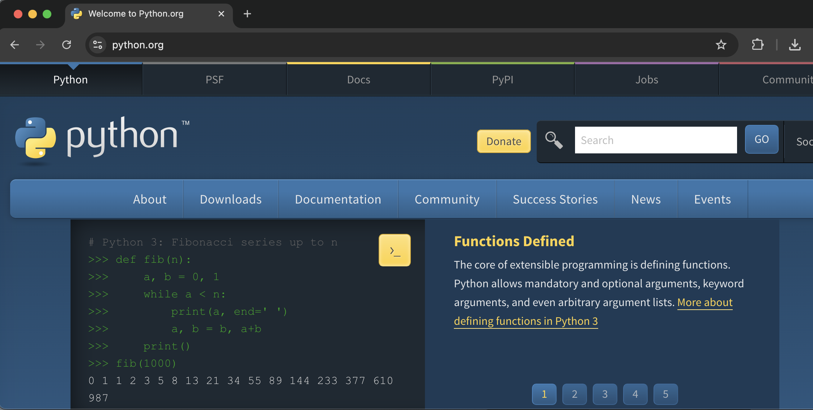

<h1>
  <span class="headline">Introduction to Selenium</span>
  <span class="subhead">Writing Your First Selenium Script</span>
</h1>

**Learning Objective:** Write a basic Python script that opens a browser and visits a URL using Selenium.

## Importing Selenium modules

Let's start by examining our test file more closely.

To start automating browsers with Python, you need to import Selenium’s core tools. These tools are _modules_—collections of code that add new abilities to your script. For browser automation, the key module is `webdriver`.

```python
from selenium import webdriver
```

This single line brings in the `webdriver` component. `webdriver` is what gives your code the power to “drive” a web browser, much like an operator using remote controls to steer a robot.

Sometimes, you may also need the `Service` module to tell Selenium exactly where to find your browser driver (like ChromeDriver):

```python
from selenium.webdriver.chrome.service import Service
```

> 📚 A _module_ is a file containing Python code that can define functions, classes, and variables. Importing a module lets you use its features in your script.

**Why do we import these?**

- `webdriver`: This is Selenium’s bridge—from your code to your browser. Nearly every Selenium script starts by importing this.
- `Service`: This helps launch and control the browser driver program, especially when it is not in a default system location.

## Initializing the webdriver

With your imports ready, the next step is to connect your script to a web browser. Selenium does this using something called a _web driver instance_. You can think of it as the “navigator” that will send directions to your browser on your behalf.

Here’s how you typically create a new Chrome browser session:

```python
# If chromedriver is on your PATH:
driver = webdriver.Chrome()

# If you need to specify the path to chromedriver:
chromedriver_path = "/Users/laurenperez/chromedriver-mac-arm64/chromedriver"

service = Service(executable_path=chromedriver_path)
driver = webdriver.Chrome(service=service)
```

**Breaking it down:**

- `webdriver.Chrome()`: Launches a new browser window using Chrome.
- The _service_ step is only necessary if your chromedriver file is not already part of your system’s PATH.

## Using `driver.get()` to navigate to a webpage

You are now ready to direct Selenium to visit a real website. The _get_ method is your direct line to the browser’s address bar.

```python
driver.get("https://www.python.org")
```

This line tells the browser to load the address you provide, just like typing it by hand and pressing Enter.



> 💡 Try changing the URL to visit any website you use for work or leisure, such as your favorite news site or a global search engine.

## Adding simple assertions to verify page load

How do you know your script succeeded in going to the right page? Assertions give you an automatic way to check if what you expect is really happening.

A simple assertion to check if the page loaded is to verify the window title includes a keyword:

```python
assert "Python" in driver.title
```

Try adding this to your test file just above `driver.quit()` .

- If the page’s title _does_ include "Python", the script keeps running.
- If not, Python raises an error right away—helping you catch mistakes early.

> 🏆 Checking the page title is a fast, low-effort way to confirm you landed at the correct site when you’re exploring or debugging.

As your skills grow, you will use assertions to check for many things—like finding an element or looking for a message—but starting simple builds good habits.

## Properly closing the browser with `driver.quit()`

When your script finishes, it is best practice to close all browser windows you opened. If you leave them open, extra background processes can build up and use computer resources.

```python
driver.quit()
```

- `driver.quit()` closes every browser window opened in this session.
- Always add this line at the end of your script—or better yet, ensure it runs even if you hit errors.

> ⚠ Common mistake: If you forget to call `driver.quit()`, you may end up with several “stray” browser processes that use up memory and slow down your machine.

## Running the script and observing browser automation in action

Let’s combine everything you’ve learned so far into a practical, working script.

```python
from selenium import webdriver
from selenium.webdriver.chrome.service import Service

# Update with the path to your chromedriver file, if not on PATH
chromedriver_path = "/Users/laurenperez/chromedriver-mac-arm64/chromedriver"

# Start the browser session
service = Service(executable_path=chromedriver_path)
driver = webdriver.Chrome(service=service)

try:
    # Navigate to the Python.org homepage
    driver.get("https://www.python.org")

    # Assert that "Python" is in the page title
    assert "Python" in driver.title

    # Print a message for feedback
    print("Page loaded correctly! Title is:", driver.title)

finally:
    # Always close the browser, even if there is an error
    driver.quit()
```

**What should you see?**

- Chrome opens automatically.
- The browser loads the Python homepage.
- The script checks the page title.
- You see a success message in the terminal.

  ```bash
  Page loaded correctly! Title is: Welcome to Python.org
  ```

- The browser closes, no matter what happened in your script.

> 😎 If you see an error, check your chromedriver path and make sure your ChromeDriver version matches your Chrome browser. If the assertion fails, check both the URL and what you expect in the title.

<div class="activity solo-exercise">
  <h2 class="title">Solo scripting sprint</h2>
  <span class="minutes">5 min</span>
</div>

Let's do it again!

Practice writing and running a real Selenium script to automate opening a webpage you use regularly. This builds confidence with the essential Selenium workflow—setup, navigation, assertion, feedback, and cleanup.

1. **Create a new Python script** in your project’s folder. Name it something like <code class="filepath">selenium_open_url.py</code> for easy recognition.

2. **Write a Selenium script**. Your script should:

   - Import the required modules.
   - Launch a new Chrome window, using a correct path for your chromedriver.
   - Open the homepage of a website you visit often (other than <https://www.python.org>).
     - Tip: Pick a public website that loads reliably, such as a global news site, search engine, or portal.
   - Use an `assert` statement to confirm that the page’s title includes a keyword or phrase you expect (e.g., "News" for a news site).
   - Print a success message to the terminal if the check works.
   - Always close the browser with `driver.quit()`, even in the event of an error.

3. **Run your script** and observe the browser window automation.

<div class="activity discussion">
  <h2 class="title">How did it go?</h2>
  <span class="minutes">2 min</span>
</div>

When automating navigation to different sites, what issues might cause your assertion to fail, even if the main page loads? For example, think about pages that show a loading screen, ask you to log in, or have dynamic titles that change based on time or user info. How could you adapt your assertion to handle these situations? Share your findings or a specific situation from your activity, and discuss your debugging process with your group.

## Knowledge checks

❓ What is the main purpose of `assert "Python" in driver.title` in your Selenium script?

- A. To close the browser after visiting a webpage.
- B. To check that the correct page loaded by looking for "Python" in the page title.
- C. To print the page title to the console.
- D. To install Selenium in your environment.

❓ Why should you always use `driver.quit()` at the end of your Selenium script?

- A. To print a summary of actions to the console.
- B. To leave the browser open for future use.
- C. To close all browser windows opened by the script and free up system resources.
- D. To check if ChromeDriver is up-to-date.
